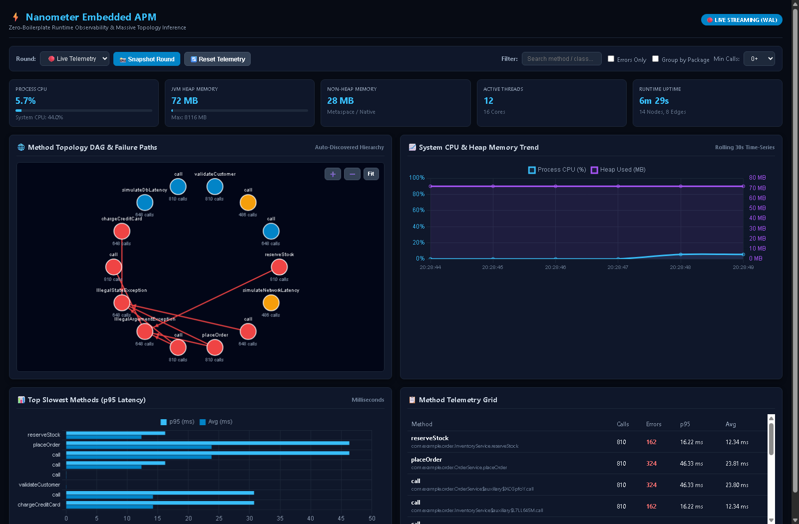

# ⚡ Nanometer: Zero-Dependency Embedded Observability Toolkit

> **Zero-boilerplate, zero-allocation APM and automated dependency topology graph inference for Java libraries and microservices.**

[](https://github.com/PIsberg/nanometer/actions/workflows/ci.yml)
[](LICENSE)

---

## 📸 Embedded APM & Multi-Round Topology Visualizer



---

## 🚀 Key Features

* **Zero-Boilerplate Bytecode Interception**: Automatically attaches `@Origin` & `@SuperCall` telemetry interceptors using ByteBuddy without polluting business code.
* **Zero-Allocation Hot Path**: Lock-free pre-allocated `MetricRingBuffer` (Disruptor pattern) with automatic load shedding under extreme traffic (< 50ns latency target).
* **Automated Causality & Topology Inference**: Automatically tracks execution spans across threads to build directed method caller-callee graphs and exception cascades.
* **Embedded Local Storage (WAL)**: Asynchronous micro-batching into local SQLite in WAL mode (`.nanometer/metrics.db`).
* **Interactive Web Dashboard**: Embedded JDK `HttpServer` (zero external dependencies) serving real-time telemetry, multi-round historical comparison, and high-density topologies at `http://localhost:9090`.
* **Hardware & JVM Telemetry**: Built-in `SystemMetricsSampler` tracking Process/System CPU %, Heap & Non-Heap Memory, active threads, and uptime.
* **Dual Build System**: First-class build support for both **Maven** and **Gradle** across **JDK 21, 25, 26**.
* **AI Governance & Guardrails**: Integrated with [VibeTags](https://github.com/PIsberg/vibetags) providing tiered guardrails for both Claude (`CLAUDE.md`, `.claude/rules/*.md`) and Gemini (`GEMINI.md`).
* **Rigorous Architecture & Concurrency Testing**: Tested with [ArchUnit](https://www.archunit.org/) and 95%+ test coverage across all subprojects.

---

## 🖥️ What the GUI Supports

The embedded Nanometer dashboard ([http://localhost:9090](http://localhost:9090)) provides an enterprise APM experience with zero configuration:

### 1. Multi-Round Simulation & Historical Snapshotting
* **Round History Management**: Capture snapshots across distinct load testing rounds (e.g. *Round 1: Baseline Warmup*, *Round 2: Peak Stress*, *Round 3: Chaos/Degraded*).
* **Live vs Historical Mode**: Instantly toggle between real-time streaming telemetry and frozen historical rounds to compare performance regression and latency shifts.
* **Telemetry Reset**: One-click reset to initiate a fresh profiling round.

### 2. High-Density Scalability for Massive Systems
* **Interactive Force-Directed Canvas**: Smooth pan-and-drag and mouse-wheel zoom (`0.2x` to `4.0x`) with "Fit to Screen" and zoom controls to explore hundreds of service and method nodes.
* **Package / Component Clustering**: Toggle **"Group by Package"** to collapse massive call trees into high-level architecture components (e.g., `com.example.order`, `com.example.inventory`, `com.example.payment`).
* **Search & Fast Filtering**: Instant client-side method, class, and package search with automatic node centering.
* **Signal-to-Noise Reduction**: 
  - **Min Calls Filter**: Filter out low-frequency noise (0+, 5+, 20+, 50+ executions).
  - **Errors Only Toggle**: Isolate active failure cascades and pinpoint root-cause exceptions.
* **Node Inspector**: Click on any node in the topology canvas to view instant latency percentiles, error rates, and call volumes.

### 3. Real-Time Hardware & JVM Resource Gauges
* **Process & System CPU Load**: Live percentage with color-coded warning/danger thresholds.
* **JVM Heap Utilization**: Live MB used vs maximum committed heap.
* **Non-Heap Memory**: Real-time Metaspace and CodeCache tracking.
* **Active Threads & Processors**: Live thread count alongside available CPU cores.
* **30-Second Rolling Time-Series Chart**: Real-time line chart plotting CPU and Heap Memory trends.

### 4. Method Performance & Latency Analytics
* **Top Slowest Methods Chart**: Side-by-side comparison of P95 vs Average execution times.
* **Method Telemetry Grid**: Full searchable table reporting calls, errors, P95, and average latency.
* **JSON REST Endpoints**:
  - `GET /api/graph`: Returns the full topology DAG, node stats, and system snapshot.
  - `GET /api/system`: Returns live JVM and CPU utilization JSON.

---

## 📦 Modules

* `nanometer-bom`: Bill of Materials for dependency management.
* `nanometer-model`: Core immutable telemetry records (`RelationalMetricEvent`).
* `nanometer-core`: Lock-free `MetricRingBuffer`, `GraphMetricAggregator`, `SystemMetricsSampler`, and `GraphAutoDiscoveryEngine`.
* `nanometer-storage`: Embedded SQLite WAL batch flusher (`MetricDatabaseFlusher`).
* `nanometer-agent`: ByteBuddy interceptor and dynamic Java agent attach (`NanometerAgent`).
* `nanometer-visualizer`: Embedded JDK HTTP server serving real-time dashboard and REST API.
* `nanometer-api`: Main bootstrap facade (`Nanometer`), shaded all-in-one JAR, and integration test suite.
* `nanometer-example`: Live e-commerce order simulation generating continuous traffic.

---

## 🛠️ Build & Test

### Maven
```bash
mvn clean test
```

### Gradle
```bash
gradle test
```

---

## 📦 Getting Started

### 1. Programmatic Attachment (Inside a Library or Service)

```java
import nanometer.Nanometer;

public class MyLibrary {
    static {
        // Auto-instrument all classes in your package
        Nanometer.install("com.mylibrary");
        
        // Launch embedded web visualizer on port 9090
        Nanometer.startVisualizer(9090);
    }
}
```

### 2. Java Agent Attachment (Without Code Changes)

```bash
java -javaagent:nanometer-api-0.1.0-all.jar=com.myapp -jar myapp.jar
```

---

## 🌐 Documentation

* [Architecture Guide](docs/architecture.md): Deep-dive into lock-free buffers, WAL storage, and bytecode interception.
* [Workflow Guide](docs/workflow.md): CI matrix, multi-JDK testing, and release procedures.
* [Usage Guide](docs/usage.md): Configuration, visualizer dashboard customization, and CLI commands.
* [AI Agent Skill](.gemini/skills/nanometer-usage/SKILL.md): Automated prompt instructions for Gemini and Claude agents.
