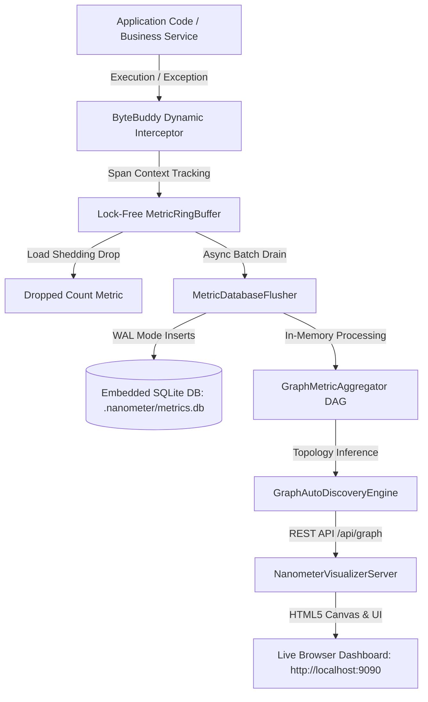
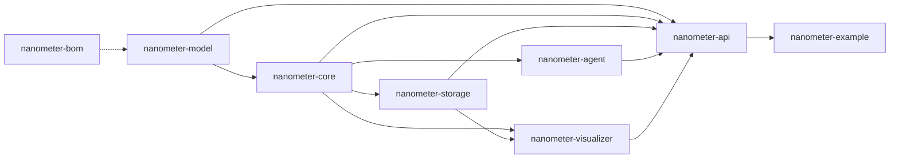
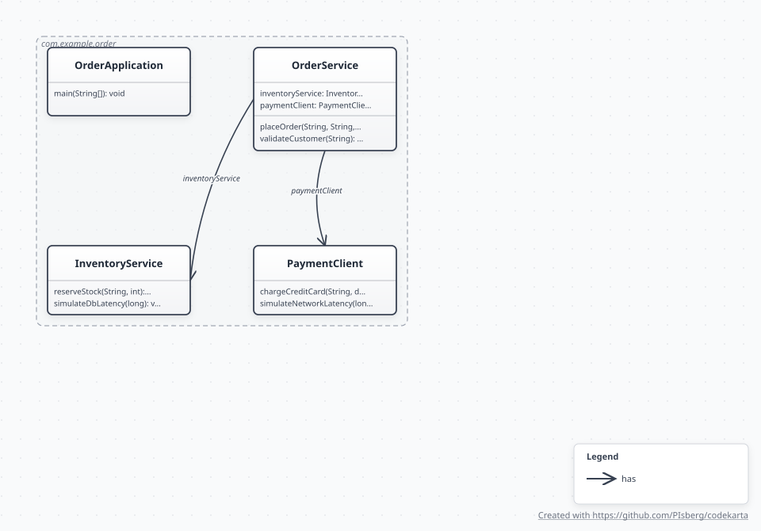
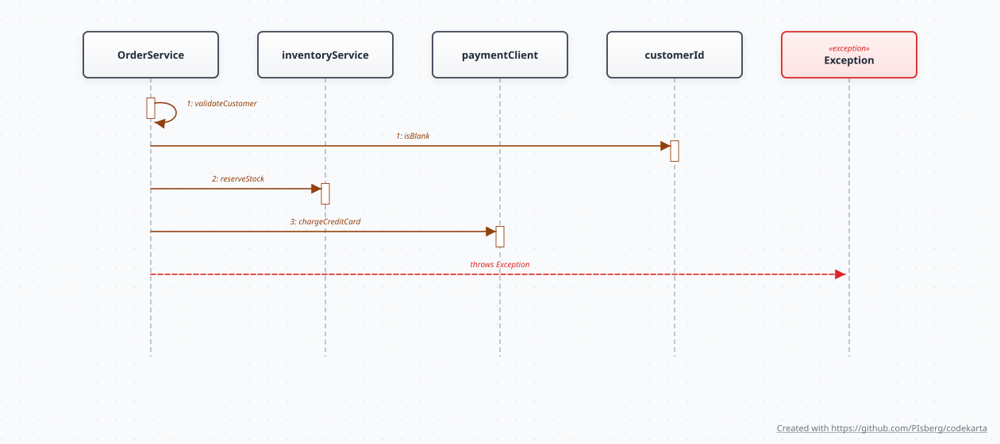

# 🏛️ Nanometer Architecture Specification

Nanometer is a zero-dependency, modular embedded observability toolkit designed to provide runtime APM telemetry, span correlation, and dynamic call topology graph inference without requiring manual metric instrumentation.

---

## 🧩 High-Level System Architecture

---

## 📦 Multi-Module Decoupling & Structure

The repository is divided into 8 decoupled submodules following strict architectural boundaries:

### Module Responsibilities
1. **`nanometer-bom`**: Bill of Materials managing dependency versions across all modules.
2. **`nanometer-model`**: Pure immutable domain model (`RelationalMetricEvent`). Zero external dependencies.
3. **`nanometer-core`**: Lock-free circular buffer (`MetricRingBuffer`), graph causality aggregator (`GraphMetricAggregator`), and chart inference engine (`GraphAutoDiscoveryEngine`).
4. **`nanometer-storage`**: Background batch persistence worker (`MetricDatabaseFlusher`) with WAL SQLite management.
5. **`nanometer-agent`**: Bytecode interception engine (`AutoMetricInterceptor`) and Java Agent dynamic attach bootstrap (`NanometerAgent`).
6. **`nanometer-visualizer`**: Embedded JDK `HttpServer` web dashboard and REST API (`NanometerVisualizerServer`).
7. **`nanometer-api`**: Main facade API (`Nanometer`), runtime lifecycle management, shaded all-in-one distribution JAR, and ArchUnit architecture tests.
8. **`nanometer-example`**: End-to-end e-commerce order processing system demonstrating auto-instrumentation.

---

## ⚡ Key Architectural Subsystems

### 1. Zero-Allocation Hot Path (`MetricRingBuffer`)
* Pre-allocated bounded ring buffer using `AtomicReferenceArray<RelationalMetricEvent>`.
* Atomic CAS write and read sequence cursor progression.
* If buffer capacity is reached (e.g. under extreme peak loads), calls to `.offer()` shed load immediately in $<50\text{ns}$, preventing thread latency amplification.

### 2. Causality & Dependency Topology Inference (`GraphMetricAggregator`)
* `ThreadLocal` span propagation automatically tracks `traceId`, `parentSpanId`, and `currentSpanId`.
* When a child method executes inside a parent method, an edge `Parent -> Child` is recorded.
* When unhandled exceptions occur, an error edge `Caller -> ExceptionNode` is created, forming a dynamic execution failure DAG.

### 3. Embedded Local Storage (`MetricDatabaseFlusher`)
* Background single-thread scheduled executor drains batches (up to 2,000 events) every 500ms.
* Local SQLite initialized with `PRAGMA journal_mode=WAL;` and `PRAGMA synchronous=NORMAL;` for high-throughput concurrent writes without locking readers.

---

## 🗺️ Code-Karta Generated Architecture Diagrams

The following architecture diagrams were generated directly from source code analysis using [code-karta](https://github.com/PIsberg/codekarta):

### Class & Domain Topology

### Stitched Multi-Tier Call Sequence & Exception Flow

