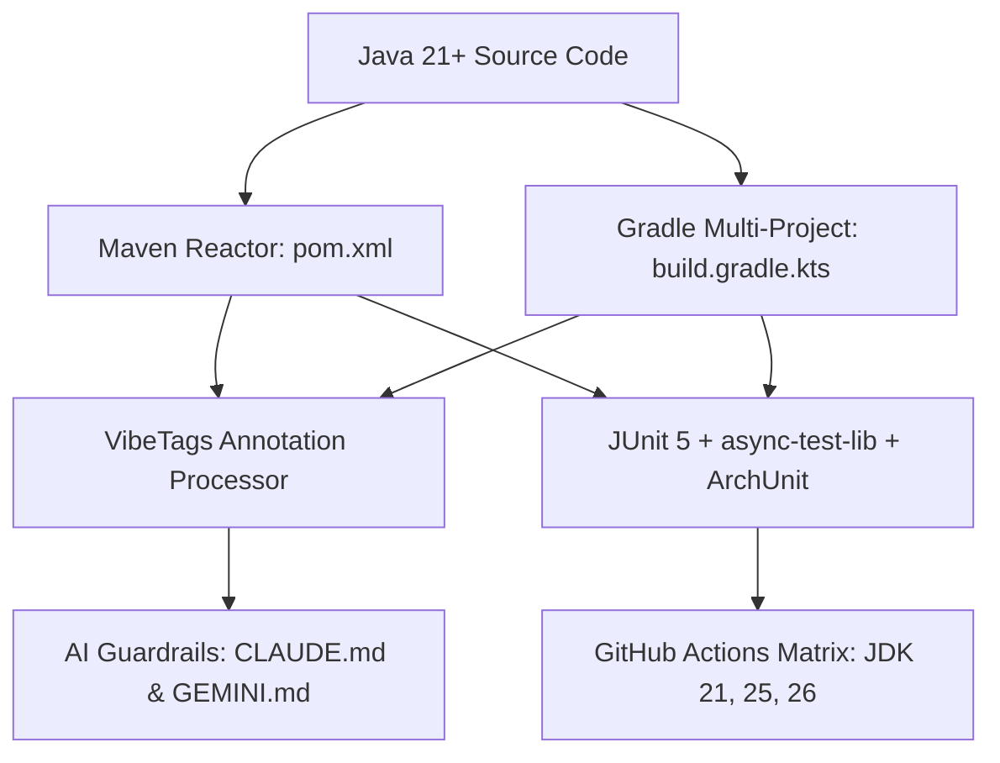

# 🔄 Development & Engineering Workflow

This document describes the engineering workflow, testing strategies, quality gates, and AI governance mechanisms employed in Nanometer.

---

## 🛠️ Dual Build System (Maven & Gradle)

Nanometer provides synchronized, first-class support for both Maven and Gradle across all submodules.

### Maven Commands
* **Full Reactor Build & Test**: `mvn clean test`
* **Static Analysis**: `mvn compile pmd:check`
* **Package Shaded Distribution**: `mvn clean package`

### Gradle Commands
* **Full Multi-Project Test**: `gradle test`
* **Run Example Application**: `gradle :nanometer-example:run`

---

## 🛡️ Quality Gates & Static Analysis

1. **ArchUnit (`NanometerArchitectureTest`)**:
   - Validates that `nanometer-model` has zero outbound dependencies.
   - Enforces package acyclicity across all components.
   - Guarantees `nanometer-buffer` is decoupled from storage and server tiers.

2. **PMD & SpotBugs**:
   - Cleaned of unused imports, redundant parentheses, and unsafe concurrent mutations.
   - Configured with modern ASM 9.7 for compatibility with JDK 21, 25, and 26.

3. **JSpecify Null Safety**:
   - Root packages marked with `@NullMarked`.
   - Nullable parameters and return values explicitly annotated with `@Nullable`.

4. **Async & Concurrency Testing (`async-test-lib`)**:
   - Uses `@AsyncTest` with Project Loom virtual threads to trigger high-concurrency collisions on `MetricRingBuffer` and `GraphMetricAggregator`.
   - Detects atomicity violations, memory visibility issues, and deadlocks automatically.

---

## 🤖 AI Governance with VibeTags

Nanometer uses [VibeTags](https://github.com/PIsberg/vibetags) to maintain continuous compile-time guardrails for AI coding assistants:

* **Tier 1 (Project Level)**: [CLAUDE.md](../CLAUDE.md) & [GEMINI.md](../GEMINI.md) provide global architectural context and pointers.
* **Tier 3 (Granular Rules)**: [.claude/rules/](../.claude/rules/) automatically loads specific guardrails when an agent opens a target file (e.g. `MetricRingBuffer.java` enforces `ZERO_ALLOCATION` and `< 50ns`).
* **Root Index (`.vibetags-root-index`)**: Compresses reactor context by keeping safety tiers inline and referencing scoped rules.

---

## 🚀 Continuous Integration (GitHub Actions)

The CI workflow in [`.github/workflows/ci.yml`](../.github/workflows/ci.yml) validates every commit against a multi-JDK matrix:

| OS | JDK Versions | Build Tools | Targets |
|---|---|---|---|
| `ubuntu-latest` | `21`, `25`, `26-ea` | `maven`, `gradle` | All 8 subprojects, unit, async, e2e, archunit, and example tests |
